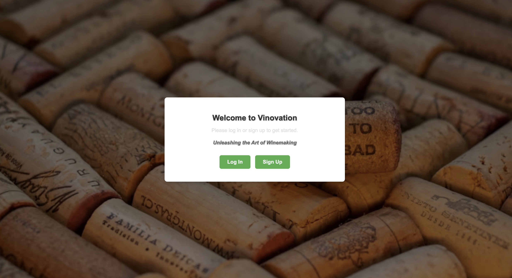

# Vinovation

  <!-- Replace with your logo or screenshot path -->

## Description
Vinovation is a Django-based web application designed to assist wine producers in managing their wine inventory effectively. With a user-friendly interface, the application allows users to track their wines from reception to bottling, manage vessels, and perform detailed analyses. The project was inspired by extensive experience in the wine production industry, aiming to simplify the daunting task of wine management.

## Functionality
- **User Authentication:** Users can create an account, log in, and manage their own wine inventory.
- **Dashboard:** An overview of all wines created by the user, providing quick access to details and actions.
- **Wine Detail Page:** Displays comprehensive information about each wine, including fermentation details, analysis, movements, current vessel, and additions. Users can edit or delete wine entries.
- **Create Wine Batch:** A form for users to add new wine lots, including fields for variety, volume or tonnage, vineyard, vessel, and lab analysis.
- **Vessels Management:** Users can create, edit, and delete vessels (e.g., stainless steel tanks or oak barrels).
- **Analysis Management:** Users can add, edit, and delete analyses related to their wines.

## Getting Started
- **Deployed App:** [Vinovation Deployed App](https://vinovation-0bd3258bdd05.herokuapp.com/) 
- **Planning Materials:** [Vinovation Planning Documents](https://trello.com/b/2zz4eA2x/vinovation) 

## Technologies Used
- Django
- Python
- HTML/CSS
- SQLite 

## Attributions
- [Django](https://www.djangoproject.com/) - A high-level Python web framework.
- [Coolers](https://https://coolors.co/palette/780000-c1121f-fdf0d5-003049-669bbc/) - Color generator website.   
- [Unsplash](https://https://unsplash.com/) - A great resource for exceptional images.

## Next Steps
- **Bottling Data:** Track data related to bottling processes and manage inventory transitions from wine to bottled products.
- **Blending Feature:** Allow users to blend wines and calculate variety percentages for the blend.
- **Financial Tracking:** Implement quarterly summaries of gains and losses to assist with tax calculations.
- **Styling Enhancements:** Improve UI/UX with additional styling and layout adjustments for a more polished appearance.

## Contributing
Contributions are welcome! If you have suggestions for improvements or new features, please open an issue or submit a pull request.

## License
This project is licensed under the MIT License. See the LICENSE file for details.

## Acknowledgements
- Thanks to the Django community for the resources and support.
- Inspired by my experience in the wine production industry.

